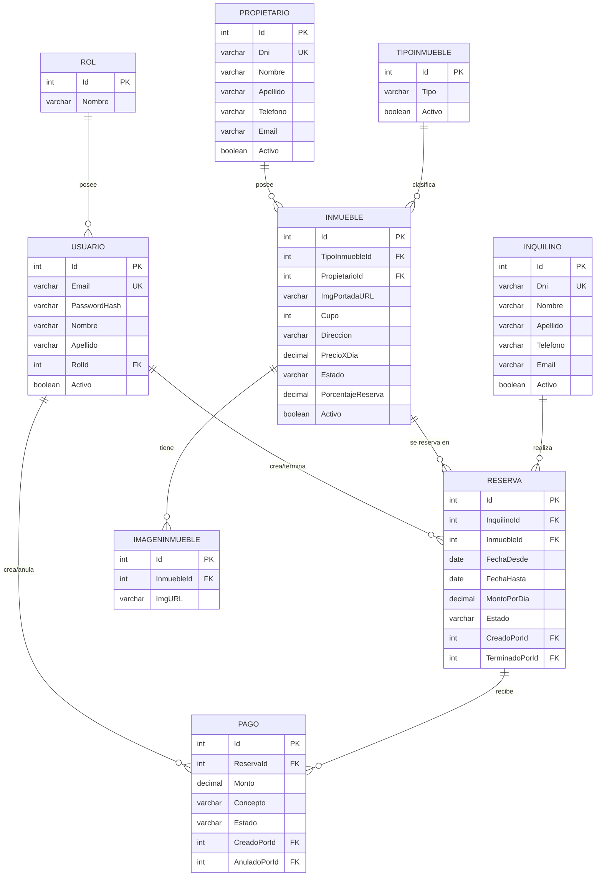

# Inmobiliaria Urbani Ferrando— Entrega 1

Sistema web de gestión inmobiliaria desarrollado con ASP.NET Core MVC, C# y MySQL. Esta primera entrega cubre el ABM (Alta, Baja, Modificación) completo de **Propietarios** e **Inquilinos**.

## Integrantes del grupo

- [Urbani Jose Maria 46260667]
- [Ferrando Carlos Enrique 28173863]

## Tecnologías utilizadas

- **Back-end:** ASP.NET Core MVC (.NET 10), C#
- **Acceso a datos:** ADO.NET puro con [MySqlConnector](https://mysqlconnector.net/)
- **Base de datos:** MySQL 8.x
- **Front-end:** Vistas Razor + JavaScript asincrónico (Fetch API / async-await)

## Arquitectura

```
Controllers/    → Orquestación HTTP. No conoce SQL ni reglas de negocio.
Services/       → Lógica de negocio (ej. validación de DNI único).
Repositories/   → Acceso a datos con ADO.NET, consultas 100% parametrizadas.
Models/         → Entidades de dominio con Data Annotations (validación server-side).
Common/         → Utilidades transversales (excepciones de negocio, etc.)
Views/          → Vistas Razor.
wwwroot/js/     → JavaScript asincrónico (fetch/async-await), validación de cliente.
Database/       → Script SQL de creación e inicialización.
```

Cada entidad (`Propietario`, `Inquilino`) implementa la interfaz genérica `IRepositorio<T>`, evitando duplicar la firma de las operaciones CRUD + paginación entre repositorios (principio DRY).

## Diagrama Entidad-Relación (DER)



## Instalación y puesta en marcha

### Requisitos previos

- [.NET SDK 10](https://dotnet.microsoft.com/download) o superior
- Servidor MySQL 8.x (recomendado: [Laragon](https://laragon.org/download/) para Windows, incluye MySQL + HeidiSQL)
- Un cliente SQL para ejecutar el script (HeidiSQL, DBeaver, MySQL Workbench, o el que prefieras)

### 1. Clonar el repositorio

```bash
git clone <https://github.com/FerrandoCarlos/inmobiliaria-Urbani-Ferrando>
cd inmobiliaria-Urbani-Ferrando
```

### 2. Crear la base de datos

1. Iniciá tu servidor MySQL (en Laragon: botón "Start All").
2. Abrí tu cliente SQL preferido y conectate con las credenciales de tu instalación local (por defecto en Laragon: usuario `root`, sin contraseña, puerto `3306`).
3. Ejecutá el script `Database/script_inicial.sql`. Este script:
   - Crea la base de datos `inmobiliaria_db`.
   - Crea el esquema completo de tablas: `rol`, `usuario`, `propietario`, `inquilino`, `tipoinmueble`, `inmueble`, `imagenesinmueble`, `reserva` y `pago`.
   - Inserta los roles (Administrador, Empleado), los usuarios de prueba iniciales.
4. Para probar paginación, filtros y listados con más volumen, ejecutá también `Database/datos_prueba.sql` a continuación. Este script carga un set de 20 registros por entidad.

### 3. Configurar la cadena de conexión

El repositorio **no incluye** el archivo `appsettings.Development.json` (está en `.gitignore` para no exponer credenciales). Creá ese archivo en la raíz del proyecto con el siguiente contenido, ajustando usuario/contraseña según tu instalación local:

```json
{
  "ConnectionStrings": {
    "DefaultConnection": "Server=localhost;Port=3306;Database=inmobiliaria_db;User=root;Password=;"
  },
  "Logging": {
    "LogLevel": {
      "Default": "Information",
      "Microsoft.AspNetCore": "Warning"
    }
  }
}
```

### 4. Restaurar dependencias y ejecutar

```bash
dotnet restore
dotnet run
```

La consola va a indicar la URL local (por ejemplo `http://localhost:5104`). Abrí esa URL en el navegador:

1. El sistema te redirigirá a la pantalla de **Inicio de Sesión**.
2. Ingresá con alguna de las credenciales de prueba (ej. `admin@inmobiliaria.com`).
3. Una vez autenticado, vas a poder navegar por las distintas secciones desde el menú principal: `/Propietarios`, `/Inquilinos`, `/Inmuebles`, `/Reservas`, `/Pagos` y `/Usuarios`.

## 🔐 Usuarios y Credenciales de prueba

El sistema cuenta con un módulo de autenticación y control de acceso basado en roles (`Administrador` y `Empleado`).

Al ejecutar el script de base de datos (`script_inicial.sql` o `datos_prueba.sql`), se crean automáticamente los siguientes usuarios de prueba para ingresar al sistema:

| Rol               | Email                       | Contraseña     | Permisos principales                                                                                                   |
| :---------------- | :-------------------------- | :------------- | :--------------------------------------------------------------------------------------------------------------------- |
| **Administrador** | `admin@inmobiliaria.com`    | _Admin123!_    | Acceso total: ABM de usuarios, eliminación/anulación de registros, gestión completa de propiedades, reservas y pagos.  |
| **Empleado**      | `empleado@inmobiliaria.com` | _Empleado123!_ | Operativa diaria: consulta y edición de propietarios, inquilinos, inmuebles, creación de reservas y registro de pagos. |

> **Nota de seguridad:** Las contraseñas en la base de datos se encuentran protegidas mediante _hashing_ seguro (`PasswordHash`) compatible con ASP.NET Core Identity.

## Funcionalidades de esta entrega

- ## Módulo de Autenticación y Autorización:
  - Login y Logout con control de acceso basado en roles (Administrador y Empleado).
  - Gestión de sesiones y protección de rutas según el rol del usuario.
- ## ABM completo (Alta, Baja lógica, Modificación, Listado paginado):
  - Propietarios e Inquilinos.
  - Tipos de Inmueble e Inmuebles (con carga y gestión de imágenes).
  - Reservas y Pagos.
  - Usuarios (con asignación de roles y actualización de datos/clave/avatar).
- ## Gestión de Reservas y Pagos:
  - Validación de negocio en Reserva: fechas coherentes (hasta > desde) y control anti-solapamiento de fechas con reservas vigentes del mismo inmueble.
  - El monto por día de la reserva se asigna en el servidor a partir del precio vigente del inmueble (evitando manipulación desde el cliente).
  - Registro de cobros (Pago) asociados a la reserva con auditoría de usuario creador (CreadoPorId).
  - Cancelación/terminación de reservas y anulación de pagos.
- ## Seguridad y Arquitectura:
  - Protección contra inyección SQL: 100% de las consultas parametrizadas vía ADO.NET puro con MySqlConnector.
  - Protección CSRF: [ValidateAntiForgeryToken] en endpoints de escritura y envío de tokens en peticiones fetch.
  - Validación doble: Data Annotations en backend (ModelState) + validación cliente mediante JavaScript asincrónico.
  - Baja lógica mediante campos Activo o cambios de Estado (en lugar de DELETE físico) con soporte para reactivación de registros.
  - Manejo diferenciado de excepciones: AppException (negocio) devuelve HTTP 400 con mensaje descriptivo; errores técnicos registran logs vía ILogger y retornan HTTP 500 sin exponer datos sensibles.
