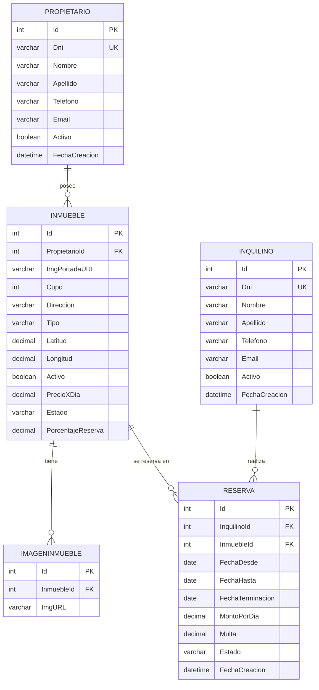

# Inmobiliaria Urbani Ferrando— Entrega 1

Sistema web de gestión inmobiliaria desarrollado con ASP.NET Core MVC, C# y MySQL. Esta primera entrega cubre el ABM (Alta, Baja, Modificación) completo de **Propietarios** e **Inquilinos**.

## Integrantes del grupo

- [Urbani Jose Maria 46260667]
- [Ferrando Carlos Enrique 28173863]

## Tecnologías utilizadas

- **Back-end:** ASP.NET Core MVC (.NET 10), C#
- **Acceso a datos:** ADO.NET puro con [MySqlConnector](https://mysqlconnector.net/)
- **Base de datos:** MySQL 8.x
- **Front-end:** Vistas Razor + JavaScript asincrónico (Fetch API / async-await)

## Arquitectura

```
Controllers/    → Orquestación HTTP. No conoce SQL ni reglas de negocio.
Services/       → Lógica de negocio (ej. validación de DNI único).
Repositories/   → Acceso a datos con ADO.NET, consultas 100% parametrizadas.
Models/         → Entidades de dominio con Data Annotations (validación server-side).
Common/         → Utilidades transversales (excepciones de negocio, etc.)
Views/          → Vistas Razor.
wwwroot/js/     → JavaScript asincrónico (fetch/async-await), validación de cliente.
Database/       → Script SQL de creación e inicialización.
```

Cada entidad (`Propietario`, `Inquilino`) implementa la interfaz genérica `IRepositorio<T>`, evitando duplicar la firma de las operaciones CRUD + paginación entre repositorios (principio DRY).

## Diagrama Entidad-Relación (DER)



> **Nota sobre alcance:** siguiendo la narrativa del proyecto, `Reserva` (llamada "Contrato" en etapas tempranas del diseño) todavía no incluye `Pago`, cálculo de multa por terminación anticipada, renovación, ni el módulo de `Usuario`/`Rol` con autenticación — funcionalidades previstas para entregas futuras. El campo `Email` es obligatorio en Propietario e Inquilino desde esta entrega.

## Instalación y puesta en marcha

### Requisitos previos

- [.NET SDK 10](https://dotnet.microsoft.com/download) o superior
- Servidor MySQL 8.x (recomendado: [Laragon](https://laragon.org/download/) para Windows, incluye MySQL + HeidiSQL)
- Un cliente SQL para ejecutar el script (HeidiSQL, DBeaver, MySQL Workbench, o el que prefieras)

### 1. Clonar el repositorio

```bash
git clone <https://github.com/FerrandoCarlos/inmobiliaria-Urbani-Ferrando>
cd inmobiliaria-Urbani-Ferrando
```

### 2. Crear la base de datos

1. Iniciá tu servidor MySQL (en Laragon: botón "Start All").
2. Abrí tu cliente SQL preferido y conectate con las credenciales de tu instalación local (por defecto en Laragon: usuario `root`, sin contraseña, puerto `3306`).
3. Ejecutá el script `Database/script_inicial.sql`. Este script:
   - Crea la base de datos `inmobiliaria_db`.
   - Crea las tablas `Propietario`, `Inquilino`, `inmueble`, `imagenesInmueble` y `reserva`.
   - Inserta un pequeño set de datos de ejemplo (3 propietarios, 3 inquilinos, 3 inmuebles, 2 reservas).
4. **Opcional:** para probar paginación, filtros y listados con más volumen, ejecutá también `Database/datos_prueba.sql` a continuación. Este script reemplaza los datos mínimos por un set de 20 registros por entidad.

### 3. Configurar la cadena de conexión

El repositorio **no incluye** el archivo `appsettings.Development.json` (está en `.gitignore` para no exponer credenciales). Creá ese archivo en la raíz del proyecto con el siguiente contenido, ajustando usuario/contraseña según tu instalación local:

```json
{
  "ConnectionStrings": {
    "DefaultConnection": "Server=localhost;Port=3306;Database=inmobiliaria_db;User=root;Password=;"
  },
  "Logging": {
    "LogLevel": {
      "Default": "Information",
      "Microsoft.AspNetCore": "Warning"
    }
  }
}
```

### 4. Restaurar dependencias y ejecutar

```bash
dotnet restore
dotnet run
```

La consola va a indicar la URL local (por ejemplo `http://localhost:5104`). Abrí esa URL en el navegador y navegá a `/Propietarios`, `/Inquilinos`, `/Inmuebles` o `/Reservas` para ver el ABM funcionando.

## Funcionalidades de esta entrega

- ABM completo (Alta, Baja lógica, Modificación, Listado paginado) de **Propietarios**, **Inquilinos**, **Inmuebles** y **Reservas**.
- Vista de detalle para cada entidad.
- Validación doble: Data Annotations en el servidor (`ModelState`) + validación espejo en JavaScript antes de cada petición asincrónica.
- Validación de negocio en `Reserva`: fechas coherentes (hasta > desde) y sin solapamiento de fechas con otra reserva Vigente del mismo inmueble.
- El monto por día de una Reserva se fija en el servidor a partir del precio vigente del Inmueble; nunca se toma del valor enviado por el cliente.
- Protección contra inyección SQL: 100% de las consultas parametrizadas, sin concatenación de strings.
- Protección CSRF: `[ValidateAntiForgeryToken]` en cada endpoint de escritura, token incluido en cada `fetch` desde el cliente.
- Baja lógica (campo `Activo`, o `Estado = 'Finalizada'` en el caso de Reserva) en vez de `DELETE` físico.
- Reactivación de registros dados de baja (Propietario, Inquilino, Inmueble).
- Manejo de errores diferenciado: excepciones de negocio (`AppException`) devuelven HTTP 400 con mensaje claro; errores técnicos inesperados se registran vía `ILogger` y devuelven HTTP 500 sin exponer detalles internos al cliente.

## Próximas entregas (fuera de alcance actual)

- Entidad `Pago`, asociada a `Reserva`.
- Terminación anticipada de `Reserva` con cálculo de multa.
- Renovación/extensión de `Reserva` sin modificar la original.
- Autenticación y autorización de usuarios (`Usuario`, `Rol`).
- Buscador con filtro en servidor para los combos de selección (Inquilino/Inmueble en el formulario de Reserva), en vez de listar todos los valores.
